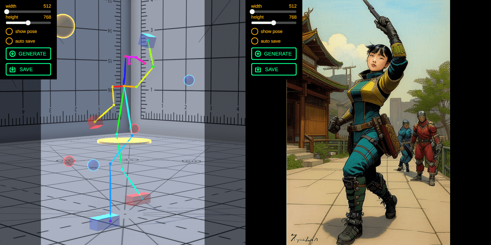

# Unity ControlNet Rig
A rigged Unity character controller with inverse kinematics built using the Animation Rigging Package, that works with OpenPose ControlNet in Automatic1111 WebUI via the API.



Example video showing usage:

[](https://youtu.be/-dD1UYu8lVs)

<!-- TABLE OF CONTENTS -->
<details>
  <summary>Table of Contents</summary>
  <ol>
    <li>
      <a href="#getting-started">Getting Started</a>
      <ul>
        <li><a href="#prerequisites">Prerequisites</a></li>
        <li><a href="#installation">Installation</a></li>
      </ul>
    </li>
    <li><a href="#usage">Usage</a></li>
    <li><a href="#license">License</a></li>
    <li><a href="#contact">Contact</a></li>
    <li><a href="#acknowledgments">Acknowledgments</a></li>
  </ol>
</details>

<!-- GETTING STARTED -->
## Getting Started

This project should be considered experimental since it relies on Automatic1111 WebUI API which changes often and this repo is not guaranteed to be updated to reflect any future conflicts. Feel free to use it as a base template to develop other interesting features and enhancements. I used code from some third party projects (links at the bottom) to initially set it up - primarily the WebUI API integration by dobrado76 which I modified to enable ControlNet use and live previews.

### Prerequisites

This project is Windows based. You will need Unity, a local installation of Automatic1111 WebUI, the ControlNet extension and OpenPose model in order for this project to function.
* Unity URP 2021.3.13f1 LTS
https://unity.com/download
  ```
  Download and install Unity Hub
  ```
  ```
  Install the Unity 2021.3.13 LTS version of the Editor from the archive
  https://unity.com/releases/editor/archive
  ```
  
* Automatic1111 WebUI
https://github.com/AUTOMATIC1111/stable-diffusion-webui
  ```
  Follow the installation instructions below *Features* in the ReadMe
  ```
* ControlNet Extension
https://github.com/Mikubill/sd-webui-controlnet
  ```
  Follow the installation instructions from the ReadMe
  ```
* ControlNet OpenPose Model
https://huggingface.co/lllyasviel/ControlNet/blob/main/models/control_sd15_openpose.pth
  Download the model and place it in the extension folder
  ```
  stable-diffusion-webui/extensions/sd-webui-controlnet/models/
  ```

### Installation

Follow these steps to get the project up and running.

1. Clone this repo to your local drive
   ```
   git clone https://github.com/hack-mans/Unity-ControlNet-Rig.git
   ```
2. Add the project folder to Unity Hub
   ```
   Projects > OPEN drop down > Add project from disk > Choose the cloned project folder
   ```
   ```
   Open the project using Unity 2021.3.13f1 (tested and working) or similar version
   ```
3. Wait for Unity to install the package dependencies and build the Library
4. Open the scene once in Unity
   ```
   Assets > HACKMANS > OpenPoseUnity > Scenes > OpenPoseUnity
   ```
5. Make sure the Game View is in **1080x1080** resolution
   ```
   GAME tab > Resolution drop down > Plus (to add new resolution) > Width & Height 1080 x 1080
   ```
6. Open the WebUI startup batch file
   ```
   Open webui-user.bat file in the WebUI root directory in Notepad or an IDE
   ```
6. Change the following line to add --api
   ```
   set COMMANDLINE_ARGS=--api
   ```
6. Launch WebUI using the edited webui-user.bat file
7. In Unity run **List Models** from the **Stable Diffusion Configuration** script
   ```
   Scene Hierarchy > StableDiffusionGenerator > Stable Diffusion Generator > List Models
   ```
8. Configure settings on **Open Pose Control Net** script
   ```
   Scene Hierarchy > OpenPoseController > Open Pose Control Net > select sampler + model + change prompt
   ```
8. Enter **Play Mode** to run, usage instructions are below
   
<p align="right">(<a href="#readme-top">back to top</a>)</p>

<!-- USAGE EXAMPLES -->
## Usage

The UI panel in the top left allows you to change resolution, preview the raw view of the OpenPose rig, generate and save images. Images are saved to the **OutputImages** folder in Assets by default but can be configured in the **Open Pose Control Net** script along with prompt and generation settings. The camera is controlled using **WASD + QE** while holding down **right mouse button**. The controls for manipulating the rig are similar to Unity (**W E R** for transforms) but all keyboard commands can be viewed or changed in the **Transform Gizmo** script attached to the **Main Camera**. Pressing **Spacebar** toggles the view of the generated image so that you can switch back to posing the rig.

<p align="right">(<a href="#readme-top">back to top</a>)</p>

<!-- LICENSE -->
## License

Distributed under the MIT License. See `LICENSE.txt` for more information.

<p align="right">(<a href="#readme-top">back to top</a>)</p>


<!-- CONTACT -->
## Contact

Twitter - [@_hackmans_](https://twitter.com/_hackmans_)

Project Link: [https://github.com/hack-mans/Unity-ControlNet-Rig](https://github.com/hack-mans/Unity-ControlNet-Rig)

<p align="right">(<a href="#readme-top">back to top</a>)</p>


<!-- ACKNOWLEDGMENTS -->
## Acknowledgments

Code from these projects was adapted for posing of the character rig and to enable ControlNet and live previews with Automatic1111 WebUI API

* [Unity3DRuntimeTransformGizmo by HiddenMonk](https://github.com/HiddenMonk/Unity3DRuntimeTransformGizmo)
* [Stable Diffusion Unity Integration by dobrado76](https://github.com/dobrado76/Stable-Diffusion-Unity-Integration)
* [Unity3d Network by ididdidi](https://github.com/ididdidi/Unity3d-Network)
* [Simple Disk Utils by Dikra Prasetya](https://assetstore.unity.com/packages/tools/simple-disk-utils-59382)

Special shout out to these projects based on ControlNet that inspired the creation of this project
* [3DCinetv Riggify Blender integration](https://3dcinetv.gumroad.com/l/osezw)
* [toyxyz Blender integration](https://toyxyz.gumroad.com/l/ciojz)


<p align="right">(<a href="#readme-top">back to top</a>)</p>
